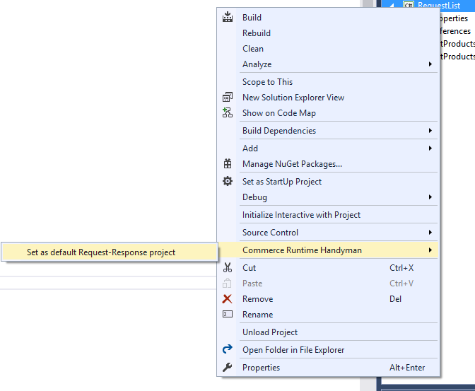
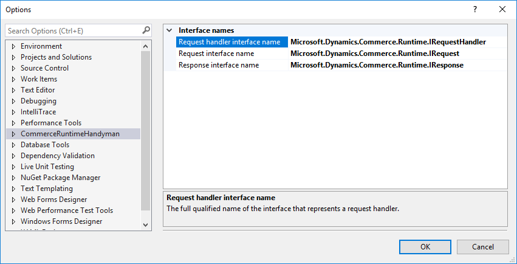

# Commerce Runtime Handyman

A Visual Studio extension to automate code authoring for the [Microsoft Dynamics AX Commerce Runtime](https://ax.help.dynamics.com/en/wiki/commerce-runtime-overview/) framework.

Please report any issues [here](https://github.com/andreesteve/crthandyman/issues).

## Supported versions

Currently supporting:

* Visual Studio 2017 15.1 (26403.7)

## Installation

You can install it:
 * from the [Visual Studio Gallery page](https://marketplace.visualstudio.com/vsgallery/fa0e1a03-00a7-45db-a6ef-dab456be41fd)
 * or by searching by **Commerce Runtime Handyman** in *Visual Studio -> Tools -> Extensions and Updates*

## Features

* Set default project for creation of *request* and *response* classes
* Create *request* and *response* classes out of method definition, including documentation

## Quick start

1. Set a default project in the solution where *request and reponse* classes are to be created in
by right clicking on the project in the solution explorer and selecting **Commerce Runtime Handyman -> Set as default Request-Response project*** 



2. Use the light bulb suggestion **Create or update request/response** to generate request response classes out of a method definition


For this snippet:

```csharp
/// <summary>
/// Gets a product.
/// </summary>
/// <param name="productId">The product id.</param>
/// <param name="someOtherResponseData">The first result.</param>
/// <returns>The found product.</returns>
public Product GetProducts(long productId, out string someOtherResponseData)
{
    someOtherResponseData = "I will be on the response definition as well";
    return new Product();
}
```

The following request will be generated:

```csharp
/// <summary>
/// Gets a product.
/// </summary>
public class GetProductsRequest : IRequest
{
    /// <summary>
    /// Initializes a new instance of the <see cref="GetProductsRequest"/> class.
    /// </summary>
    /// <param name="productId">The product id.</param>
    public GetProductsRequest(long productId)
    {
        this.ProductId = productId;
    }    

    /// <summary>
    /// Gets the product id.
    /// </summary>
    public long ProductId { get; private set; }
}
```

And following response will be generated:

```csharp
/// <summary>
/// The response for <see cref="{GetProductsRequest}" />.
/// </summary>
public class GetProductsResponse : IResponse
{
    /// <summary>
    /// Initializes a new instance of the <see cref="GetProductsResponse"/> class.
    /// </summary>
    /// <param name="Product">The found product.</param>
    /// <param name="someOtherResponseData">The first result.</param>
    public GetProductsResponse(Product product, string someOtherResponseData)
    {
        this.Product = product;
        this.SomeOtherResponseData = someOtherResponseData;
    }    

    /// <summary>
    /// Gets the found product.
    /// </summary>
    public Product Product { get; private set; }

    /// <summary>
    /// Gets the first result.
    /// </summary>
    public string SomeOtherResponseData { get; private set; }
}
```

## Settings

You can configure the extension settings at **Tools -> Options -> Commerce Runtime Handyman**



## Contributing

Please report issues and submit open pull requests [here](https://github.com/andreesteve/crthandyman).

To build and run the extension, you will need to [install Visual Studio SDK](https://msdn.microsoft.com/en-us/library/mt683786.aspx).